<div align="center">



**git push, but louder.**

[](https://github.com/OkeyAmy/faaa/actions/workflows/ci.yml)
[](https://github.com/OkeyAmy/faaa/releases)

[](LICENSE)

</div>

---

You push code. Nothing happens. The commit goes out and the only
acknowledgement you get is a wall of `Enumerating objects`. That's not a
workflow, that's a funeral.

`faaa` plays a sound every time a push actually lands. The sound can be the
current trending meme, a classic, or that one clip you found at 2am. Failed pushes
stay silent, because you don't deserve a sound for those.

## Install

```sh
curl -fsSL https://raw.githubusercontent.com/OkeyAmy/faaa/main/install.sh | sh
```

Windows (PowerShell):

```powershell
irm https://raw.githubusercontent.com/OkeyAmy/faaa/main/install.ps1 | iex
```

Or `npm i -g faaa`, or `go install github.com/okeyamy/faaa/cmd/faaa@latest`.

That's one binary: no runtime, no daemon. The installer puts it on your
`PATH` and arms git.

## Use

```sh
faaa
```

The first run wires itself into git for every repo on the machine. There's
no step two.

```
  f a a a   git push, but louder                          ✂ 15s   ◉ armed

                 ▇▁▂█▄███│█▄
                 ████████│██▃▃▄▅▂ ▅
              ▁▁▂████████│██████████████████▇████▇█▆▇▆▄▃▆▆▄▅▅▃▄▄▄▄▃▃▃▂▂▂
         ░░░░░░░░████████│█████████▓██▓▓▓▓▓▓▒▒▓▓▒▒▓▒▒▒▒░▒▒▒▒▒░▒▒░▒░░░░░░
                 █▓▓█████│██▒▒▒▒▒░▒ ░░

  FAAAH                                      0:01 ━━━━━━━●───────── 0:02

  / search or paste a link              all  ·  trending  ·  classics  ·  mine

  ▌ FAAAH                                                           ◉  0:02
    FAHHHHHHHH                                                         0:02
    Vine Boom                                                          0:01
```

| key             | action                               |
| --------------- | ------------------------------------ |
| `space`         | preview                              |
| `enter`         | arm it: this plays on your next push |
| `/`             | search anything, or paste a link     |
| `tab`           | trending / classics / mine           |
| `[` `]`         | clip length, 5–60s                   |
| `j` `k` `g` `G` | move, top, bottom                    |
| `t`             | cycle theme                          |
| `x`             | mute                                 |

Search isn't limited to the list. Type a name and faaa looks it up online
while you type.

## Bring your own sound

Saw a sound on TikTok, Reels or Shorts? Copy the link and paste it into the
search box, or:

```sh
faaa add https://www.tiktok.com/@someone/video/7106594312292453675
faaa add ./my-sound.mp3 "the name"
faaa add https://example.com/clip.mp3
```

TikTok video links need nothing else installed. Sound pages
(`tiktok.com/music/...`) are locked behind TikTok's signed API, so open any
video using the sound, hit Share, then Copy link, and paste that. Instagram, YouTube and friends go
through `yt-dlp`, which faaa fetches once (3MB) if you have Python, and those
links also need `ffmpeg`.

## It doesn't just take the first 15 seconds

Long sounds get cut to your clip length, but the cut isn't taken from the
start. Intros are boring. faaa scans the whole track and scores every window
on:

- **loudness**, since the part everyone remembers is rarely the quiet part;
- **onset density**, measured with spectral flux, so the window actually has something happening in it;
- **repetition**, by matching chroma against the rest of the track, because the section that comes back is the hook;
- **dead air**, which is penalized.

Then it snaps the start to the nearest hit so the clip lands on a beat instead
of mid-syllable, fades the edges and normalizes loudness. A 4-minute track
takes about half a second.

```sh
faaa length 25     # or [ ] in the picker
```

## Commands

```
faaa                     open the picker (first run arms git)
faaa add <file|link>     your own sound
faaa search <words>      find a sound online
faaa set <id>            arm a sound without the picker
faaa length [sec]        clip length
faaa list                everything available
faaa update              pull the newest trending list now
faaa fail <id|off>       a sound for rejected pushes (sad-violin works)
faaa volume [0-100]      because it's 2am
faaa theme [name]        terminal ink tokyonight catppuccin rosepine gruvbox nord
faaa off | on            mute / unmute
faaa share <id>          submit your sound to the shared list
faaa doctor              something's quiet, find out why
faaa uninstall           disarm and restore your git config exactly
```

## On a call?

```sh
FAAA_MUTE=1 git push     # this push only
faaa off                 # until faaa on
```

## Team anthem

Drop a `.faaa` file in a repo:

```
vine-boom
sad-violin
```

Line one is what plays when anyone on the team pushes there. Line two,
if present, plays when a push gets rejected. Commit it. Your coworkers will
thank you. Probably.

## Configure

`~/.config/faaa/config.json`

```json
{
  "theme": "terminal",
  "colors": { "accent": "#F05033" },
  "max_seconds": 15,
  "volume": 0.6,
  "fail_sound": "sad-violin",
  "player": ["mpv", "--really-quiet"]
}
```

The default theme is `terminal`. It uses your terminal's 16 ANSI colors, so
faaa matches whatever you've already set up: Omarchy, rose-pine, a scheme you
wrote by hand. `ink` is monochrome with git orange. The color slots are `fg`,
`dim`, `accent`, `accent2`, `hot`, `ok` and `border`, and any of them can be
overridden with hex or an ANSI number. `player` defaults to whatever the OS already
has: `pw-play` / `paplay` / `aplay` on Linux, `afplay` on macOS, PowerShell on
Windows.

## The built-in sounds

The classics ship inside the binary so faaa works offline on first run.
They're in `internal/audio/builtin/`:

```sh
cp ~/Downloads/emotional-damage.mp3 internal/audio/builtin/
# add to internal/audio/builtin/builtin.json:
#   {"id": "emotional-damage", "title": "Emotional Damage"}
go build -o faaa ./cmd/faaa
```

Order in `builtin.json` is menu order, and the first entry is the default. For
something only you want, use `faaa add`, which needs no rebuild.

## How it works

Git has no post-push hook, so faaa builds one out of what git does provide.

1. A global `pre-push` hook records which commits are about to go out and the current remote-tracking refs, then hands off to a detached process and exits in about 2ms. Your push never waits on it.
2. That process waits for `git push` to exit, then checks whether `refs/remotes/<remote>/<branch>` moved to the commit you pushed. If it did, the push landed and the sound plays. If the push was rejected, nothing plays.

On git versions with config-based hooks, it's registered as
`hook.faaa-push` and runs alongside `.git/hooks`, husky and whatever else you
have. Older git falls back to a `core.hooksPath` shim that chains to each
repo's own hooks. `faaa doctor` tells you which mode you're in.

The trending list is rebuilt every few hours by a GitHub Action and fetched in
the background with an ETag. Nothing runs on commit, checkout, status or fetch.

## Contributing

```sh
go test ./...
sh scripts/e1e.sh ./faaa   # real push / fetch / reject in a sandboxed $HOME
go run ./scraper           # rebuild the trending list
```

Submitting a sound: `faaa share <id>`, or open a PR adding it to
[`community/`](community/README.md). Only submit sounds you made or have the
right to share.

## License

[MIT](LICENSE). Sounds belong to their creators. The repository stores links, not
audio, apart from the built-in classics.
